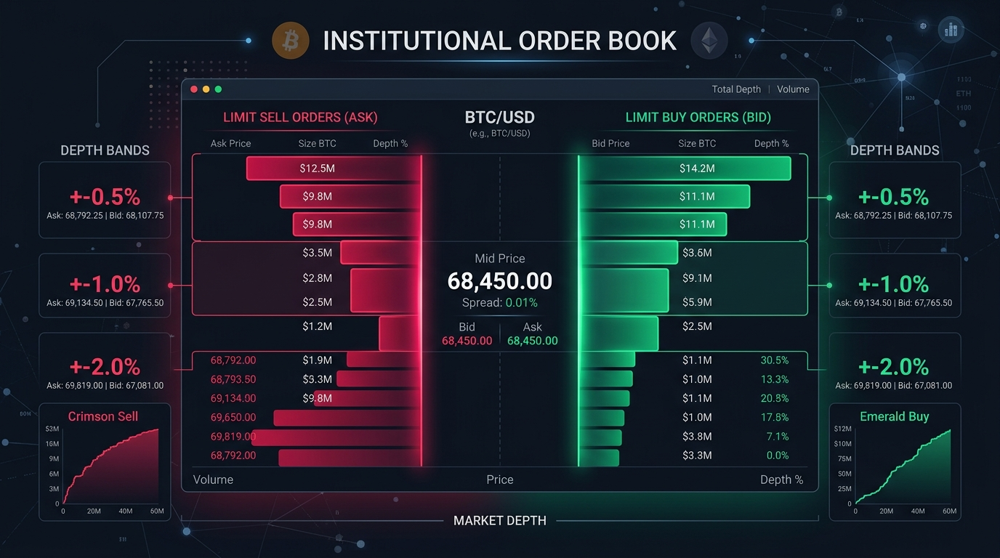
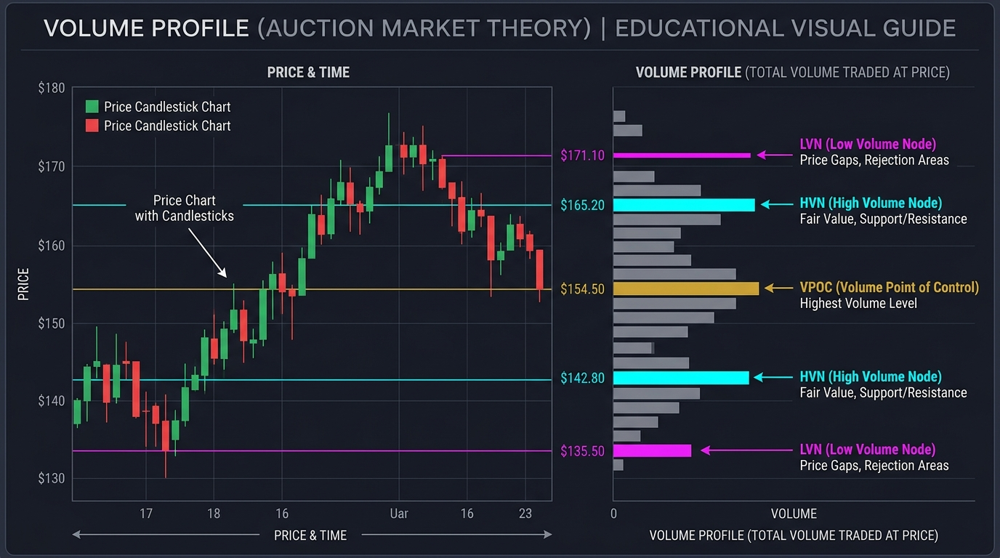
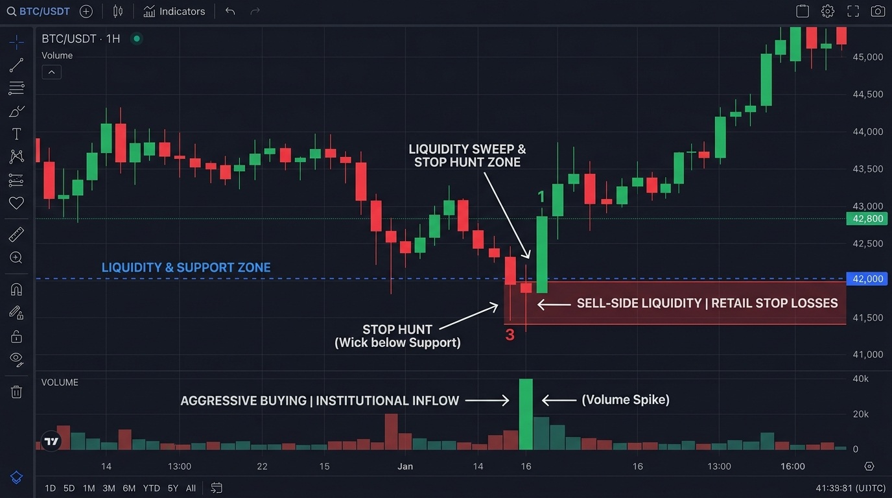

# 🎓 Order Flow & Market Structure Masterclass

Welcome to the **Liquidity Pulse 3.6 Order Flow & Market Structure Masterclass**. This guide is designed for intermediate traders who have basic chart knowledge (candlesticks, support/resistance) but are new to **Order Flow**, **Auction Market Theory**, **Volume Profiles**, and **Liquidity Sweeps**.

---

## 📖 Table of Contents
1. [Module 1: Order Flow Foundations & Order Book Mechanics](#module-1-order-flow-foundations--order-book-mechanics)
2. [Module 2: Auction Market Theory & Volume Profile (VPOC / HVN / LVN)](#module-2-auction-market-theory--volume-profile-vpoc--hvn--lvn)
3. [Module 3: Liquidity Sweeps & Stop Hunts](#module-3-liquidity-sweeps--stop-hunts)
4. [Module 4: Order Book Depth Imbalances & Delta](#module-4-order-book-depth-imbalances--delta)
5. [Module 5: Liquidation Cascades in Crypto Futures](#module-5-liquidation-cascades-in-crypto-futures)
6. [Module 6: Pine Script Horizontal S/R Density Clustering](#module-6-pine-script-horizontal-sr-density-clustering)

---

## Module 1: Order Flow Foundations & Order Book Mechanics

Traditional technical analysis focuses purely on price charts (what happened in the past). **Order Flow analysis** examines the actual mechanics of buyer and seller interactions in real-time (why price is moving now).

### 1.1 Limit Orders (Passive Liquidity) vs. Market Orders (Aggressive Liquidity)

Every market transaction requires two counterparties:

- **Limit Orders (Passive Liquidity)**:
  - Placed by traders willing to wait for a specific price.
  - Sit in the **Order Book** as Bids (buyers below market) or Asks/Offers (sellers above market).
  - Provide liquidity to the market.
- **Market Orders (Aggressive Liquidity)**:
  - Executed by traders who want immediate execution at current market prices.
  - Cross the bid-ask spread and consume passive limit orders in the order book.
  - **Price moves ONLY when aggressive market orders consume all passive limit orders at a given price level.**

### 1.2 The Institutional Order Book

The **Order Book** records all passive limit bids and limit asks:
- **Best Bid**: The highest price a buyer is willing to pay.
- **Best Ask**: The lowest price a seller is willing to accept.
- **Spread**: The difference between Best Ask and Best Bid.
- **Depth Bands ($\pm 0.5\%, \pm 1.0\%, \pm 2.0\%$)**: Aggregate dollar volume of limit orders waiting within specified percentage ranges of the current mid-price.

---

## Module 2: Auction Market Theory & Volume Profile (VPOC / HVN / LVN)

Auction Market Theory states that financial markets exist to **facilitate trade** between buyers and sellers through a continuous double auction.

### 2.1 The 3 Key Pillars of Volume Profile

Unlike traditional volume indicators at the bottom of a chart (which show volume traded over time), a **Volume Profile** displays volume traded at specific price levels.

1. **Volume Point of Control (VPOC)**:
   - The exact price level where the **highest total volume** was traded during the sample period.
   - Represents **Fair Value** anchor where buyers and sellers agreed most strongly.
   - Price frequently magnetizes back toward VPOC during consolidation.

2. **High Volume Nodes (HVN)**:
   - Price regions with high traded volume clusters.
   - Act as **Acceptance Zones** and strong support/resistance reaction points.

3. **Low Volume Nodes (LVN)**:
   - Price regions with low traded volume (air pockets or liquidity voids).
   - Represent **Rejection Zones**. Price moves rapidly through LVNs with little resistance or slippage because few passive limit orders are parked there.

---

## Module 3: Liquidity Sweeps & Stop Hunts

Large institutional market participants (market makers, hedge funds) cannot enter or exit multi-million dollar positions without moving the market against themselves unless they access **dense liquidity pools**.

### 3.1 Where Liquidity Hides

Retail traders are taught to place stop-losses just above obvious Swing Highs or below obvious Swing Lows:
- **Sell-Side Liquidity (SSL)**: Clusters of sell-stop orders resting below key support levels.
- **Buy-Side Liquidity (BSL)**: Clusters of buy-stop orders resting above key resistance levels.

### 3.2 Anatomy of a Liquidity Sweep

1. **The Drive**: Institutional money pushes price past an obvious S/R level.
2. **The Trigger**: Retail stop-loss orders are triggered. A stop-loss for a long position becomes a market sell order!
3. **The Fill**: Institutional buyers absorb those market sell orders at wholesale prices.
4. **The Reversal**: Once retail stops are consumed, price immediately reverses direction, leaving a long candle wick.

> [!TIP]
> **Tactical Rule**: Never buy right as support breaks or short as resistance breaks. Wait to see if volume delta confirms a genuine breakout or a liquidity sweep reversal!

---

## Module 4: Order Book Depth Imbalances & Delta

Order Book Depth Imbalance measures the relative strength of passive buyers vs. passive sellers.

### 4.1 Imbalance Delta Calculation

$$\text{Imbalance Delta \%} = \frac{\text{Bid Depth USD} - \text{Ask Depth USD}}{\text{Bid Depth USD} + \text{Ask Depth USD}} \times 100$$

- **Positive Delta (> +15%)**: Passive Bids heavily outweigh Asks $\rightarrow$ Strong underlying price support.
- **Negative Delta (< -15%)**: Passive Asks heavily outweigh Bids $\rightarrow$ Overhead supply pressure.

### 4.2 Absorption vs. Exhaustion

- **Absorption**: Aggressive market sellers hit a support level with huge volume, but price refuses to fall. This indicates a large passive institutional limit bid is **absorbing** all selling pressure.
- **Exhaustion**: Market volume dries up as price approaches a level, indicating buyers or sellers have run out of aggressive order flow.

---

## Module 5: Liquidation Cascades in Crypto Futures

In leveraged crypto derivative markets (Binance / Bybit Futures), positions have strict liquidation prices.

When price hits a liquidation threshold, the exchange forcibly closes the position by issuing a **Market Force Order (`@forceOrder`)**:
- Long Liquidation $\rightarrow$ **Forced Market SELL**
- Short Liquidation $\rightarrow$ **Forced Market BUY**

### 5.1 The Cascade Effect

When price moves rapidly:
$$\text{Price Drop} \rightarrow \text{Long Liquidations} \rightarrow \text{Market Sells} \rightarrow \text{Further Price Drop} \rightarrow \text{Next Liquidation Tier}$$

Liquidity Pulse 3.6 monitors `@forceOrder` streams over a **3-minute sliding window**:
> [!WARNING]
> When liquidation volume exceeds **$5,000,000 USD** in 3 minutes, market liquidity becomes temporarily depleted, creating sharp price wicks and high-probability mean-reversion bounce opportunities.

---

## Module 6: Pine Script Horizontal S/R Density Clustering

Liquidity Pulse 3.6 calculates support and resistance using quantitative Pine Script pivot logic rather than subjective human drawing.

### 6.1 Pivot Detection Math

A candle at index $i$ is flagged as a **Pivot High** if:
$$High[i] > High[i-k] \quad \forall k \in [1, 10] \quad \text{and} \quad High[i] \ge High[i+k] \quad \forall k \in [1, 10]$$

### 6.2 Density Clustering ($0.35\%$ Threshold)

Raw pivots are clustered using spatial density grouping:
- Pivots within $0.35\%$ of each other are merged into a single horizontal zone.
- Touch counts across 500 candles are tallied.

### 6.3 Conviction Matrix

| Touch Count | Volume Confluence | Conviction Tier | Actionable Strategy |
| :--- | :--- | :--- | :--- |
| $\ge 3$ touches | Yes (VPOC / HVN) | 🔥 **HIGH CONVICTION** | High probability reversal / bounce zone |
| $2$ touches | Optional | ⚡ **MEDIUM CONVICTION** | Secondary key level |
| $1$ touch | No | ▫️ **MINOR PIVOT** | Informational swing level |

---

## 🎯 Summary Checklist for Traders

1. **Check Session Open**: Note whether you are trading Asia, London, or NY open.
2. **Locate VPOC**: Determine if price is above (bullish bias) or below (bearish bias) the VPOC anchor.
3. **Identify High Conviction S/R**: Focus execution near levels with $\ge 3$ touches and VPOC/HVN volume confluence.
4. **Watch for Sweeps**: Look for price wicks beyond S/R clusters accompanied by $5M+ liquidation cascades.
